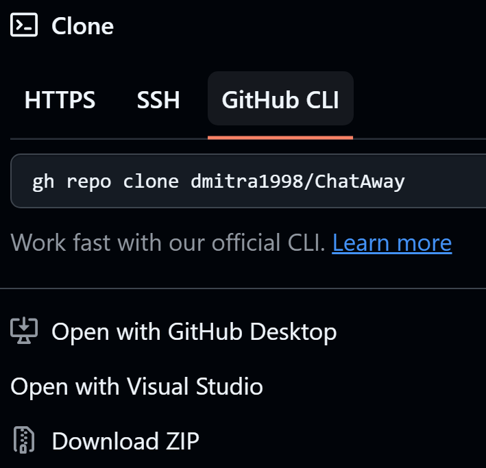
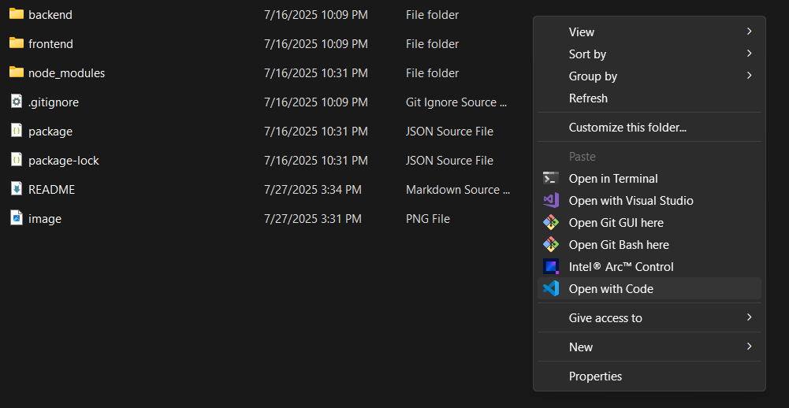
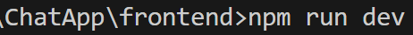
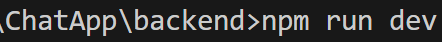
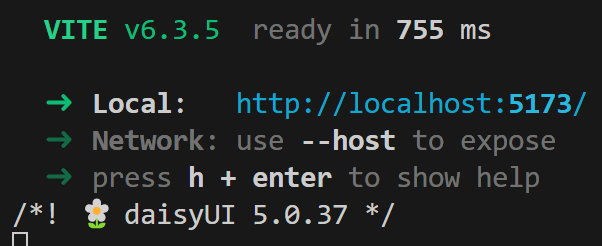

"# ChatAway" 
# ChatAway

ChatAway is a web application where users can send text messages and photos to friends. Users can change the theme of the application and upload their own profile picture. Users can login with their Google account or create an account. The front end was built with React.js and the back end was developed using Node.js and Express.js. The application uses Socket.io for real-time communication and MongoDB for data storage. DaisyUi and Tailwind CSS were used to style the application. I have launched the app [here](https://chataway-refs.onrender.com/login). 

The application is still in progress

## Setup

The app is very i easy to setup. Just follow the steps below to set it up.

1) Either download the project as a ZIP file or clone it using the command as shown in the image.

2) Once the project has been downloaded or cloned go to the project folder (called ChatApp) and open it with any of your favourite editor. I will use VSCode for the setup process.

3) After opening the project folder open two terminals. To open a terminal go to the top menu bar where you will see the option called "View". Select it then select "Terminal" from the drop down as in the picture. Follow the same process to open another terminal.

3) Now go to the following directories from the project folder to install dependencies:-
    a) In one terminal type "cd frontend" to go to the frontend folder.
    b) In another terminal type "cd backend" to go to the backend folder.
    c) In both the terminal type "npm install" to install all the dependencies.

4) From the terminal run "npm run dev" in the frontend folder and the backend folder.
 

5) You will see something similar to this image

Now you can signin, signup to send text and images to others.

## Future Plans

I plan to install a search functionality where users can search other users.